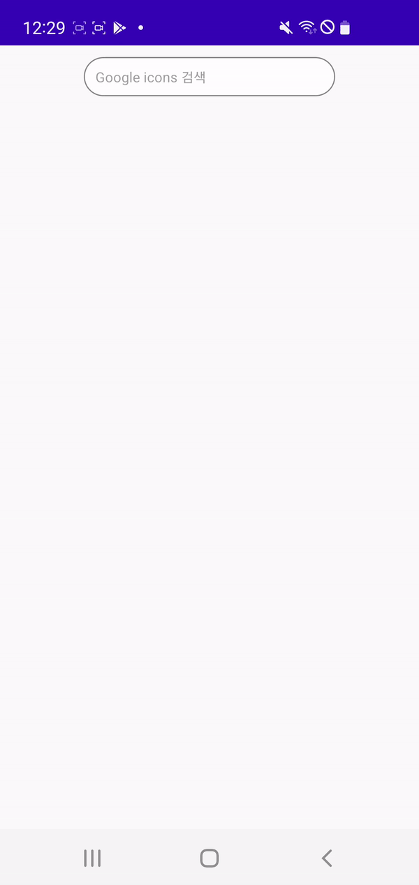

# FirebaseStorage multi search sample

### 개요

1. 이 예제는 사용자가 입력한 내용의 일부분을 검색하여 복수 개의 결과를 가져오는 작업을 다룹니다.

2. Firebase Storage에서 멀티서치를 다루는 자료가 부족하여 직접 제작하게 되었습니다. 그러나 예제보다 더 효율적인 방법이 있을 수도 있습니다.

3. Firebase 라이브러리의 모든 부분을 다루지 않으며 꼭 필요한 부분만을 설명합니다.

   

---

### 개발환경

* Platform <b>Android</b>
* Language <b>Kotlin 1.5</b>
* Library <b>Firebase, Glide</b>


---

### 미리보기

예제를 통해 아래와 같은 결과물을 만들 수 있습니다.

  

---

### 준비

1. Firebase Storage를 생성하고 앱 프로젝트에 적용해주세요. 자세한 절차는 [Firebase 문서](https://firebase.google.com/docs/android/setup?authuser=1) 를 참조하세요.

2. Firebase Storage의 Rules를 설정해주세요. 아래는 모든 사용자가 열람할 수 있는 Read only의 예시입니다.

   ```
   rules_version = '2';
   service firebase.storage {
     match /b/{bucket}/o {
       match /{allPaths=**} {
         allow read;
       }
     }
   }
   ```

3. Firebase Storage에 검색할 수 있는 이미지 파일을 업로드하세요. 예제에서는 Google에서 제공하는 Material Icon을 사용합니다.

   + Google material icons는 구글에서 해상도별로 제공하는 아이콘 디자인 모음입니다. <b>예제를 수월하게 따라 하실 수 있도록 이름과 폴더를 깔끔하게 정리하여 깃 저장소에 올려두었습니다.</b>

4. Firebase, Glide 라이브러리를 모듈 수준 build.gradle에 삽입하세요.

   ```groovy
   // Firebase
   implementation platform('com.google.firebase:firebase-bom:29.1.0')
   implementation 'com.google.firebase:firebase-storage'
   
   // Glide
   implementation 'com.github.bumptech.glide:glide:4.13.0'
   annotationProcessor 'com.github.bumptech.glide:compiler:4.13.0'


---

### Firebase 개요


구글이 소유한 모바일 애플리케이션 개발 플랫폼으로 Firestore Database, Realtime Database, Storage뿐만 아니라 호스팅 또는 출시 및 모니터링까지도 지원하고 있습니다. 예제는 이 중에서 Storage를 사용했습니다.


Firebase Storage는 애플리케이션이 이미지나 동영상 파일 등을 저장하고 공유할 수 있도록 해줍니다. 클라우드에 업로드되어 있는 파일들을 내려받을 수도 있고 업로드할 수도 있습니다. 네트워크 상태가 좋지 못할 때 자동으로 중단된 위치부터 작업을 재시도해 주는 장점도 있습니다.  

​    

### Firebase Storage 사용방식

<b><단일 파일에 대한 Uri을 불러오는 방법></b>

1. 먼저 FirebaseStorage의 instance를 가져옵니다.

```kotlin
val storage = FirebaseStorage.getInstance()
```

​      

2. 그런 다음 업로드 또는 다운로드할 파일의 경로를 참조해야합니다. 단일 파일이라면 아래와같이 child() 메소드를 사용하면됩니다.

```kotlin

val storage = FirebaseStorage.getInstance()
val reference: StorageReference = storage.reference.child("google_icons/drawable-xhdpi/icon.png")

```

  변수 reference는 StorageReference 타입입니다. 이 레퍼런스를 가지고 Url을 다운로드하거나 업로드 할 수 있으며 경로가 단일 파일이 아니라면 레퍼런스를 리스트로 구성할 수도 있습니다. 레퍼런스를 리스트로 구성하는 방법에 대해서는 아래에서 설명하겠습니다.


3. 레퍼런스로 해당 경로의 이미지 파일을 열람할 수 있는 Url을 얻습니다.

```kotlin
reference.downloadUrl.addOnSuccessListener { uri ->
	/* 다운로드에 성공한 경우입니다 */
  /* Uri값을 받습니다 */

}.addOnFailureListener { exception ->
	/* 다운로드에 실패한 경우입니다 */
}
```

downloadUrl는 비동기적으로 작업을 실행합니다. 개발자가 네트워킹 작업을 위해 스레드를 따로 생성할 필요가 없습니다.  

​      

<b><폴더 전체를 대상으로 Uri를 가져오는 방법></b>

경로가 단일 파일을 지정하는 것이 아닌 "/google_icons/drawable-xhdpi/" 처럼 상위 폴더만을 지정했을 때 하위 경로에 있는 모든 파일을 참조할 수 있는 방법도 있습니다. 이때는 StorageReference의 list() 또는 listAll() 메소드를 사용합니다.

list()는 pageToken을 통해 파일들에 대한 StorageReference를 일정 단위로 잘라서 가져올 수 있습니다. 일관된 페이지 수를 제공해야 하거나 추가 결과를 가져올 시기를 제어할 때 사용합니다.  

listAll()은 하위 경로에 있는 모든 파일에 대한 StorageReference를 리스트형태로 반환 받을 수 있습니다.

​    

1. list(): StorageReference를 100개 단위로 가져오는 예제입니다.

```kotlin
fun listAllPaginated(pageToken: String?) {
  val reference: StorageReference = storage.reference.child(
    "google_icons/drawable-xxhdpi/"
  ) // drawable-xxhdpi폴더의 하위 항목들에 대한 StorageReference를 생성합니다.

  val listPageTask: Task<ListResult> = if(pageToken != null) {
    reference.list(100, pageToken)
  } else {
    reference.list(100)
  }

  listPageTask.addOnSuccessListener { listResult ->
		// 100개 단위로 StorageReference를 받을 수 있습니다.
    val referenceList: List<StorageReference> = listResult.items

    /* 다음 페이지로 진행할 수 있습니다. */
    listResult.pageToken?.let { pageToken -> listAllPaginated(pageToken) }

  }.addOnFailureListener {

  }
}

override fun onCreate(savedInstanceState: Bundle?) {
  super.onCreate(savedInstanceState)
  setContentView(R.layout.activity_main)

  listAllPaginated(null) // 첫 페이지 토큰을 null로 할당합니다.

  // ... ///

```

  

​    

2. listAll() - StorageReference를 한번에 가져오는 예제입니다.

```kotlin
val reference: StorageReference = storage.reference.child(
  "google_icons/drawable-xxhdpi/"
) // drawable-xxhdpi폴더의 하위 항목들에 대한 StorageReference를 생성합니다.

val listAllTask: Task<ListResult> = reference.listAll()
listAllTask.addOnFailureListener {

}.addOnCompleteListener {
  if (it.isSuccessful) {
    /* 성공적으로 결과를 불러왔을 경우입니다 */            
    val referenceList: List<StorageReference> = it.result!!.items

    // ... //
  }
}
```


---

### 예제

예제는 사용자가 입력한 내용의 일부분을 포함하는 이미지 파일을 검색하고, 검색된 파일을 리사이클러뷰에 표시하는 작업으로 구성되어 있습니다.

​    

1. 디바이스의 네트워크 상태를 체크하세요.

   NetworkStates.kt의 메소드를 통해 네트워크의 순간적인 상태 확인 또는 실시간으로 네트워크 이벤트를 수신받을 수 있습니다. 아래는 네트워크 상태가 변동될 때 Callback을 받는 예시입니다.

   ```kotlin
   /* NetworkStates.kt */
   fun AppCompatActivity.registerNetworkCallback(networkCallback: ConnectivityManager.NetworkCallback) {
     val connectivityManager = ContextCompat.getSystemService(
       this,
       ConnectivityManager::class.java
     ) as ConnectivityManager
   
     val networkRequest = NetworkRequest.Builder()
     .addTransportType(NetworkCapabilities.TRANSPORT_CELLULAR)
     .addTransportType(NetworkCapabilities.TRANSPORT_WIFI)
     .build()
     connectivityManager.registerNetworkCallback(networkRequest, networkCallback)
   }
   
   
   /* MainActivity */
   /* 네트워크 상태가 변동될 때 Callback 됩니다. */
   private val networkCallback = object: ConnectivityManager.NetworkCallback() {
     override fun onAvailable(network: Network) {
       super.onAvailable(network)
       /* 네트워크가 활성화 된 경우 */
     }
   
     override fun onLost(network: Network) {
       super.onLost(network)
       /* 네트워크가 비활성화되거나 끊어진 경우 */
     }
   }
   
   override fun onResume() {
     super.onResume()
   
     registerNetworkCallback(networkCallback)
   
     // ... //
   }
   ```    

   ​      

2. 이미지 파일이 들어있는 전체경로를 얻습니다. 만약 이미지 파일이 해상도별로 구분되어 있다면, 아래처럼 getDeviceDpi() 유틸 메소드를 사용하여 디바이스의 해상도를 경로에 적용시킬 수 있습니다.

   ```kotlin
   override fun onCreate(savedInstanceState: Bundle?) {
     super.onCreate(savedInstanceState)
     setContentView(R.layout.activity_main)
   
     if(!getNetworkState()) {
       /* 순간적인 네트워크 상태를 알 수 있습니다 */
       Toast.makeText(this, "연결된 네트워크가 없습니다.", Toast.LENGTH_SHORT).show()
   
     } else {
       // directory path ex) https://firebase-storage/google_icons/drawable-xxhdpi/
       directoryPath = "google_icons/drawable-${getDeviceDpi()}/"
       storageAllReference = storage.reference.child(directoryPath)
   
       val listAllTask: Task<ListResult> = storageAllReference.listAll()
       listAllTask.addOnFailureListener {
         /* 리스트를 불러오는 데에 실패한 경우입니다. */
   
       }.addOnCompleteListener {
         if(it.isSuccessful) {
           /* 성공적으로 결과를 불러왔을 경우입니다 */
           imageFileReferences = it.result!!.items
           editText.isEnabled = true // 결과를 불러오기 전에 레퍼런스가 참조되는 것을 막습니다.
         }
       }
     }
   }
   ```

  EditText의 enabled 기본값은 false입니다. 이는 전체 경로를 참조할 수 있는 StorageReference 리스트가 생성되지 않았을 때 사용자가 검색하는 것을 방지합니다.

​    

3. 사용자가 파일 이름의 일부분을 입력하게되면, StorageReference 리스트에서 불러올 파일이 있는지 확인하고 파일의 개수를 확인합니다. 아래 코드는 StorageReference의 <b>getName</b> 메소드와 <b>contains()</b>를 조합하여 파일 이름에 사용자가 입력한 내용이 포함되는지 확인합니다.

```kotlin
override fun onResume() {
  editText.setOnEditorActionListener { textView, actionId, keyEvent ->
    if(actionId == EditorInfo.IME_ACTION_SEARCH) { // 검색 버튼을 눌렀을 때
      val uriList = ArrayList<Uri>()
      val fileName = textView.text.toString()
      var itemCount = 0

      progressBar.visibility = View.VISIBLE
      editText.isEnabled = false

      for(reference in imageFileReferences) {
        if(reference.name.contains(fileName)) {
          ++itemCount // 불러올 파일 개수를 확인
        }
      }

      if(itemCount == 0) { // 해당하는 항목이 없을 경우
        progressBar.visibility = View.GONE
        editText.isEnabled = true
        Toast.makeText(this, "검색 결과가 없습니다.", Toast.LENGTH_SHORT).show()
        true
      }

      // ... 아래 코드에서 계속 ... //
    }
  }
}
```

​      

4. 불러올 파일이 있다면 StorageReference의 <b>getDownloadUrl()</b> 메소드를 사용해 Uri를 가져옵니다.

```kotlin
for(reference in imageFileReferences) {
	if(reference.name.contains(fileName)) {
    reference.downloadUrl.addOnSuccessListener { uri ->
  		uriList.add(uri)
                                                
      if(uriList.size == itemCount) { // 검색 완료
        // 검색 결과 넘겨주기
      	val intent = Intent(this@MainActivity, SubActivity::class.java)
        intent.putExtra("URI_LIST", uriList)
        startActivity(intent)

        progressBar.visibility = View.GONE
        editText.isEnabled = true
    	}
                                                
    }.addOnFailureListener {
    	/* 다운로드에 실패한 경우입니다 */
      progressBar.visibility = View.GONE
      editText.isEnabled = true
    }
  }
}
```

  주의할 점은 <b>getDownloadUrl()</b> 메소드는 한번 호출되면 자체적으로 비동기적으로 처리합니다. 스레드를 따로 생성할 필요는 없지만 메인 스레드와는 별개로 처리되기 때문에 for 문이 끝나도 downloadUrl 작업은 여전히 실행되고 있을 수 있습니다. 그렇기 때문에 for문이 끝났을 때 반환값을 처리하는 것이 아니라 의도한 검색 결과 개수가 일치할 때 반환값을 처리해야 합니다. 위의 코드는 uri를 담는 리스트의 사이즈가 미리 계산한 itemCount의 값과 일치할 때 반환값을 처리합니다.

​       

5. 검색된 결과를 리사이클러뷰에 표시합니다. 이미지 파일을 그대로 가져온 것이 아닌, Uri를 가져왔기 때문에 Glide 라이브러리를 사용하여 이미지를 표시하는 것이 편리합니다.

```kotlin
/* SubActivity */
override fun onCreate(savedInstanceState: Bundle?) {
  super.onCreate(savedInstanceState)
  setContentView(R.layout.activity_sub)

  uriList = intent.getParcelableArrayListExtra("URI_LIST") ?: ArrayList()

  iconRecyclerViewAdapter = IconRecyclerViewAdapter(this)

  // 리사이클러뷰에 3열의 GridLayoutManager 를 적용합니다.
  val gridLayoutManager = GridLayoutManager(this, 3)
  recyclerView.layoutManager = gridLayoutManager
  recyclerView.adapter = iconRecyclerViewAdapter

  for(uri in uriList) {
    iconRecyclerViewAdapter!!.addItem(uri)
  }
}


/* IconRecyclerViewAdapter */
// ... //

override fun onBindViewHolder(holder: ViewHolder, position: Int) {
  val item = iconItems[position]
  Glide.with(context)
  .load(item.uri)
  .into(holder.imageView)
}

fun addItem(uri: Uri) {
  iconItems.add(IconRecyclerViewItem(uri))
  notifyItemInserted(iconItems.size-1)
}

// ... //

```


---

### 후기

  현재는 여러 개의 파일 Url을 하나씩 다운로드하고 있습니다. 이 경우 이미 요청되어진 downloadUrl에 대해서는 사용자가 중간에 작업을 취소할 수 없다는  문제점이 있습니다. 예제의 궁극적인 목표는 검색된 파일에 대한 Url을 다운로드할 때 한번에 요청 하고 중간에 취소가 가능한 Handling Task를 만드는 것이었지만 downloadUrl 만으로는 한계가 있음을 알게되었습니다. 목표 도달에는 실패했지만 더 성장해서 완성도있는 프로젝트로 업데이트하겠습니다.
